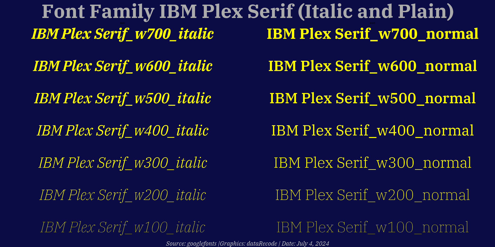

fetchgooglefont
================

# fetch_google_font

## Overview

The <code style="color:#E69F00">fetch_google_font</code> API provides a
streamlined way to download and register Google Fonts for R
visualizations using the <code style="color:#E69F00">showtext</code> and
<code style="color:#E69F00">sysfonts</code> packages. It retrieves font
files from the Google Fonts API for a specified font family, supporting
weights from 100 to 900 in both plain and italic styles, where
available. The API registers these fonts with unique family names (e.g.,
<code style="color:#E69F00">IBM Plex Serif_w400_normal</code>) for use
in <code style="color:#E69F00">ggplot2</code> plots, Rmarkdown reports,
and other R graphics.

To ensure accurate font names and available weights/styles, consult
[Google
Fonts](https://fonts.google.com/specimen/IBM+Plex+Serif?query=Scotch).
The API sends requests to the Google Fonts API, downloads `.ttf` files,
and registers them with <code style="color:#E69F00">sysfonts</code>. If
a weight or style is unavailable, it skips it with a warning. The API
requires the <code style="color:#E69F00">showtext</code>,
<code style="color:#E69F00">sysfonts</code>,
<code style="color:#E69F00">stringr</code>,
<code style="color:#E69F00">dplyr</code>, and
<code style="color:#E69F00">httr</code> packages, which can be installed
using <code style="color:#E69F00">pacman</code>.

**Figure 1: Visualization of IBM Plex Serif weights** - A two-panel plot
showing 1`italic` and `plain`.

<figure id="fig:plexserif-visualization">

<figcaption aria-hidden="true">Visualization of IBM Plex Serif
weights</figcaption>
</figure>

## Installation

You can install the development version of
<code style="color:#E69F00">fetch_google_font</code> from GitHub using:

``` r
# Install devtools if not already installed
install.packages("devtools")

# Install fetch_google_font
devtools::install_github("username/repo-name")
```

The API depends on the following R packages, which can be installed
using <code style="color:#E69F00">pacman</code>:

``` r
install.packages("pacman")
pacman::p_load(showtext, sysfonts, stringr, dplyr, httr)
```

Ensure these packages are installed before using the API.

## Usage

The <code style="color:#E69F00">fetch_google_font</code> API fetches
font files from Google Fonts and registers them with
<code style="color:#E69F00">sysfonts</code>. It supports weights 100–900
and both plain and italic styles, where available. Verify font names and
variants at [Google
Fonts](https://fonts.google.com/specimen/IBM+Plex+Serif?query=Scotch).

Below is an example of fetching the “IBM Plex Serif” font and creating a
visualization to display its weights and styles.

``` r
# Load required packages
pacman::p_load(showtext, sysfonts, stringr, dplyr, ggplot2)

# Define weights to fetch
weights_to_test <- seq(100, 900, by = 100)

# Specify font family
font_g_ni <- "IBM Plex Serif"

# Fetch and register fonts
font_families <- fetch_google_font(
  font_family = font_g_ni,
  weights = weights_to_test,
  styles = c("normal", "italic")
)

# Enable showtext
showtext_auto()

# Prepare data for visualization
dat_2 <- font_families() %>%
  as_tibble() %>%
  rename(family = value) %>%
  filter(str_detect(family, font_g_ni)) %>%
  mutate(
    face = if_else(grepl("normal$", family), "plain", "italic"),
    x = 1,
    y = seq_along(family)
  ) %>%
  group_by(face) %>%
  mutate(y = seq_len(n())) %>%
  ungroup()

# Define colors
text_clr <- "#FFFF00"
bkgd_clr <- "#0B0B45"

# Create visualization
gg_fnt <- dat_2 %>%
  ggplot(aes(x, y)) +
  geom_text(
    aes(label = family, family = family, fontface = face),
    color = text_clr, size = 20
  ) +
  facet_wrap(vars(face), ncol = 2) +
  labs(
    title = sprintf("Font Family: %s (Plain and Italic)", font_g_ni),
    caption = "Source: Google Fonts | Graphics: dataRecode | Date: July 4, 2025"
  ) +
  theme_void() +
  theme(
    plot.background = element_rect(fill = bkgd_clr, color = bkgd_clr),
    plot.title = element_text(
      hjust = 0.5, color = "gray67", size = 74,
      family = "IBM Plex Serif_w700_normal"
    ),
    plot.caption = element_text(
      hjust = 0.5, color = "gray77", size = 24,
      family = "IBM Plex Serif_w400_italic"
    ),
    legend.position = "none"
  )

# Display plot
print(gg_fnt)
```

## Notes

- **Font Verification**: Confirm font names and available weights/styles
  at [Google Fonts](https://fonts.google.com). Not all fonts support all
  weights (100–900) or italic styles.
- **Error Handling**: If a weight or style is unavailable, the API
  issues a warning and skips it.
- **Dependencies**: Ensure all required packages are installed via
  <code style="color:#E69F00">pacman::p_load</code>.
- **Performance**: Fetching multiple weights/styles may take time,
  depending on the font and network speed.
- **Font Names**: Registered fonts have unique names (e.g.,
  <code style="color:#E69F00">IBM Plex Serif_w400_normal</code>) to
  avoid conflicts.

## Contributing

Contributions to improve the API or documentation are welcome! Please
submit issues or pull requests to the [GitHub
repository](https://github.com/username/repo-name).

## License

This project is licensed under the MIT License. See the `LICENSE` file
for details.
